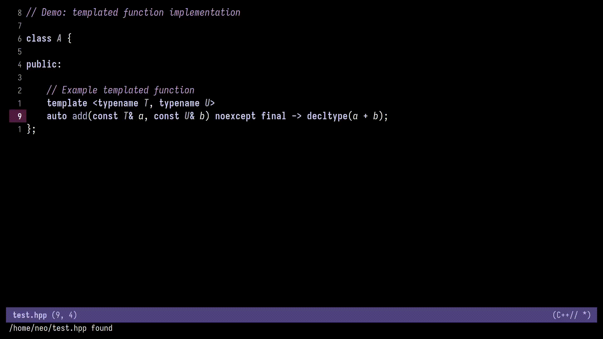

- [Overview](#org55edca2)
- [Demo](#org8344660)
- [Features](#org8d2fcbe)
- [Requirements](#orgdbfcf75)
- [Installation](#org647e2e3)
- [Usage](#org0171ea2)
- [Customizations](#org2f66a0a)
  - [`cpp-func-impl-comment-string`](#orgd90d318)
- [Limitations](#org24c0188)
- [License](#orgfc5bea7)
- [Contributing](#orgd8bf85b)


<a id="org55edca2"></a>

# Overview

This Emacs package provides a utility to generate out-of-line method implementations for C++ classes. It leverages [Tree Sitter](https:tree-sitter.github.io/tree-sitter/) for accurate parsing of C++ declarations directly from header files.

Place your cursor on a C++ method declaration inside a header file, run the command, and the function body will be automatically generated and inserted in the corresponding source (.cpp) file.

Templated methods are fully supported.

<div class="warning" id="org8dac365">
<p>
I am new to Emacs Lisp and this plugin is still in early stages and it might not work all the time.
Please open an issue if there are any problems.
</p>

</div>


<a id="org8344660"></a>

# Demo

-   Regular functions


-   Templated functions




<a id="org8d2fcbe"></a>

# Features

-   Parses C++ class and method declarations using Tree-sitter.
-   Generates implementation stubs with correct return type and fully qualified names.
-   Automatically switches to the corresponding source file.
-   Handles both regular and templated methods.
-   Optionally inserts a TODO comment stub inside the function body.


<a id="orgdbfcf75"></a>

# Requirements

-   Emacs 29+ with Tree-sitter support.
-   C++ major mode using Tree-sitter backend (\`c++-ts-mode\`).
-   A valid project structure with corresponding \`.cpp\` files discoverable via \`ff-find-other-file\`.


<a id="org647e2e3"></a>

# Installation

1.  Ensure `Tree-sitter` is enabled in Emacs and that `c++-ts-mode` is active.
2.  Add this file to your Emacs load path.
3.  Require the library or load during C++ mode using a hook:

```emacs-lisp
(require 'cpp-func-impl)
```

1.  Use the command \`cpp-func-impl-implement\` when on a function in a class. Optionally bind it to a key:

```emacs-lisp
(define-key c++-ts-mode-map (kbd "C-c C-i") #'cpp-func-impl-implement)
```


<a id="org0171ea2"></a>

# Usage

1.  Open a C++ header file (.hpp).
2.  Place the cursor on the name of the method declaration (regular or template).
3.  Run:
    
    ```emacs-lisp
       M-x cpp-func-impl-implement
    ```

4.  You will be taken to the corresponding \`.cpp\` file, and the method stub will be inserted at the bottom of the file.

If you call the command with a prefix argument (e.g. \`C-u M-x cpp-func-impl-implement\`), a \`// TODO: Implement\` comment is inserted.


<a id="org2f66a0a"></a>

# Customizations

You can customize the comment inserted into the implementation body by setting the variable `cpp-func-impl-comment-string`.


<a id="orgd90d318"></a>

## `cpp-func-impl-comment-string`

The comment string can include valid format specifiers mentioned below which get injected with information like `method-name`, `class-name`, `time`, `date`.

Following format specifiers are supported:

| Format Specifier | Meaning      |
|---------------- |------------ |
| %c               | Class Name   |
| %m               | Method Name  |
| %t               | Current Time |
| %d               | Current Date |

```elisp
(use-package cpp-func-impl
  :ensure nil
  :load-path "<load-path>"
  :custom
  (cpp-func-impl-comment-string "// TODO: Implement `%m` for the class `%c. Added at `%t` on `%d`"))
```


<a id="org24c0188"></a>

# Limitations

-   Only works in C++ files (not C).
-   Requires header/source pair to be correctly mapped.
-   Does not support auto-discovery of already existing method definition.
-   Does not support nested environment.
-   Only works when the cursor is on top of the function name.


<a id="orgfc5bea7"></a>

# License

MIT License


<a id="orgd8bf85b"></a>

# Contributing

Contributions, suggestions, or bug reports are welcome. Feel free to fork and submit a pull request or open an issue.
