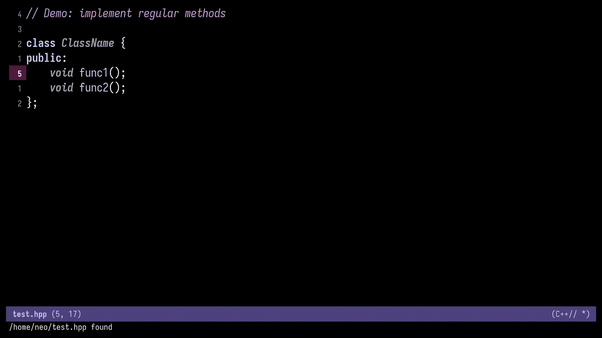
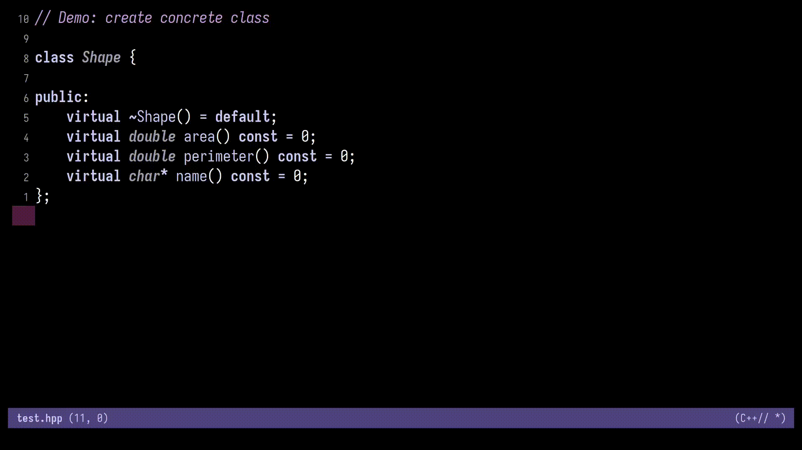

- [Overview](#overview)
- [Demo](#demo)
- [Features](#features)
- [Requirements](#requirements)
- [Installation](#installation)
- [Usage](#usage)
- [Customizations](#customizations)
  - [`cpp-func-impl-comment-string`](#cpp-func-impl-comment-string)
- [Limitations](#limitations)
- [License](#license)
- [Contributing](#contributing)

# Overview

This Emacs package provides a utility to generate out-of-line method implementations for C++ classes. It leverages [Tree Sitter](https:tree-sitter.github.io/tree-sitter/) for accurate parsing of C++ declarations directly from header files.

Place your cursor on a C++ method declaration inside a header file, run the command, and the function body will be automatically generated and inserted in the corresponding source (.cpp) file.

Templated methods are fully supported.

> [!CAUTION]
> I am new to Emacs Lisp and this plugin is still in early stages and it might not work all the time.
> Please open an issue if there are any problems.

# Demo

1. Implement function at point

    -   Regular functions

    

    -   Templated functions

    

2. Implement all methods in a class

   

3. Create concrete class from another class

   


# Features

+ Implement all the methods in a class
+ Implement function at point
+ Implement concrete class from a given class

> [!NOTE]
> Concrete class are ordinary classes that can be instantiated and have no virtual functions.

# Requirements

-   Emacs 29+ with Tree-sitter support.
-   C++ major mode using Tree-sitter backend (\`c++-ts-mode\`).
-   A valid project structure with corresponding \`.cpp\` files discoverable via \`ff-find-other-file\`.

# Installation

1.  Ensure `Tree-sitter` is enabled in Emacs and that `c++-ts-mode` is active.
2.  Add this file to your Emacs load path.
3.  Require the library or load during C++ mode using a hook:

```emacs-lisp
(require 'cpp-func-impl)
```

1.  Use the command \`cpp-func-impl-implement\` when on a function in a class. Optionally bind it to a key:

```emacs-lisp
(define-key c++-ts-mode-map (kbd "C-c C-i") #'cpp-func-impl-implement)
```

# Usage

1.  Open a C++ header file (.hpp).
2.  Place the cursor on the name of the method declaration (regular or template).
3.  Run:

    ```emacs-lisp
       M-x cpp-func-impl-implement
    ```

4.  You will be taken to the corresponding \`.cpp\` file, and the method stub will be inserted at the bottom of the file.

If you call the command with a prefix argument (e.g. \`C-u M-x cpp-func-impl-implement\`), a \`// TODO: Implement\` comment is inserted.

# Customizations

You can customize the comment inserted into the implementation body by setting the variable `cpp-func-impl-comment-string`.

## `cpp-func-impl-comment-string`

The comment string can include valid format specifiers mentioned below which get injected with information like `method-name`, `class-name`, `time`, `date`.

Following format specifiers are supported:

| Format Specifier | Meaning      |
|------------------|--------------|
| %c               | Class Name   |
| %m               | Method Name  |
| %t               | Current Time |
| %d               | Current Date |

```elisp
(use-package cpp-func-impl
  :ensure nil
  :load-path "<load-path>"
  :custom
  (cpp-func-impl-comment-string "// TODO: Implement `%m` for the class `%c. Added at `%t` on `%d`"))
```

# Limitations

-   Only works in C++ files (not C).
-   Requires header/source pair to be correctly mapped.
-   Does not support auto-discovery of already existing method definition.
-   Does not support nested environment.
-   Only works when the cursor is on top of the function name.

# License

MIT License

# Contributing

Contributions, suggestions, or bug reports are welcome. Feel free to fork and submit a pull request or open an issue.
